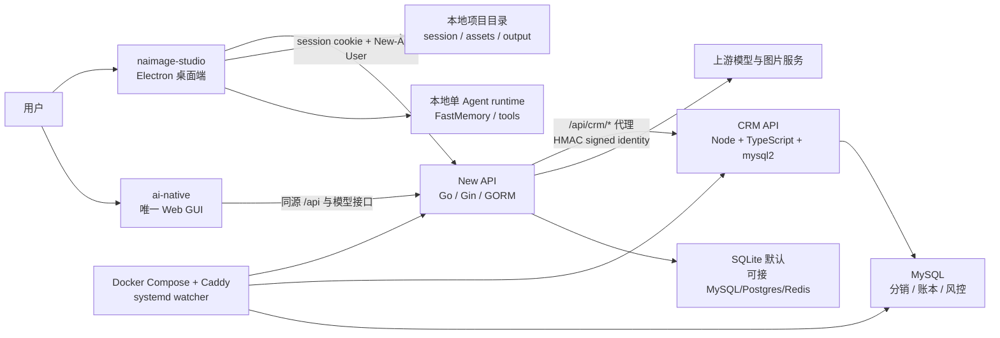
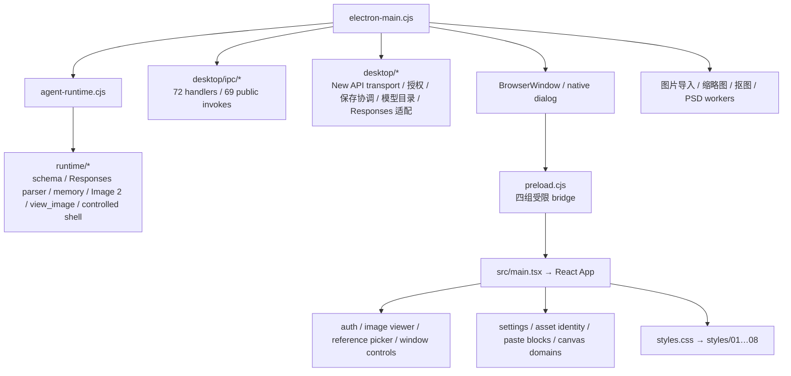

# naimage 工作区上下文地图

> 最近同步：2026-07-27
> 工作区：`E:\019创业项目\nimage`  
> 目的：让开发者和 Agent 快速判断两个项目分别负责什么、修改从哪里进入、需要同步哪些契约和测试。

## 1. 两个项目分别是什么

| 项目 | 产品角色 | 主要运行位置 | 技术栈 | 权威数据 |
| --- | --- | --- | --- | --- |
| `naimage-studio/` | Windows 桌面创作客户端；无限画布、单 Agent、本地项目/素材/会话、图片导入导出与自动更新 | 用户 Windows 电脑 | Electron 42、React 18、TypeScript、Vite 8、Node/CommonJS、Sharp/PNGJS/OpenCV.js、少量 .NET 工具 | 本地项目 session、项目素材、画布关系、本地 FastMemory、桌面更新状态 |
| `ai-native/` | naimage 的统一后端与运营 monorepo；账号、session、角色、quota、模型路由/计费、唯一 Web GUI、生产部署；现有 CRM 为待删除的旧模块，本轮不修改 | 本地多进程或 Linux/Docker 生产环境 | Node 24、pnpm workspace、Go 1.25/Gin/GORM、React 19/TypeScript/Rsbuild/TanStack/Tailwind 4、Bun workspace、原生 Node HTTP + mysql2、MySQL/SQLite/Postgres/Redis、Docker Compose/Caddy/systemd | 账号身份、角色、quota、模型目录、计费与用量日志、发布清单；CRM 数据仅在旧模块内 |

一句话判断：

- 改桌面画布、项目文件、Agent 本地工具、导入导出或安装更新客户端：进入 `naimage-studio/`。
- 改登录、模型服务、余额/计费、CRM、Web 管理界面、后端 API 或生产部署：进入 `ai-native/`。
- 改远端 API、模型 DTO、更新 manifest 或认证规则：通常需要两边同步。

## 2. 跨项目总体拓扑



## 3. `naimage-studio` 上下文

### 3.1 进程边界



Renderer 没有 Node integration。文件系统、窗口原语、远端会话和更新操作必须通过 `preload.cjs` 的受限 bridge。

### 3.2 当前模块化结果

| 原热点 | 当前状态 | 新边界 |
| --- | --- | --- |
| `src/main.tsx` | 仍是跨域编排热点，但认证、图片查看、参考图选择、窗口控制、设置持久化和多个画布纯域已移出 | `auth-gate.tsx`, `image-viewer.tsx`, `reference-picker-dialog.tsx`, `window-controls.tsx`, `settings-persistence.ts` 与画布域模块 |
| `electron-main.cjs` | 仍是主进程 facade；模型/Responses/项目持久化/New API transport/client、设备授权和 72 个 IPC handler 已有独立 owner | `desktop/ipc/*`, `desktop/model-catalog.cjs`, `desktop/agent-responses-adapter.cjs`, `desktop/project-*`, `desktop/new-api-transport.cjs`, `desktop/new-api-client.cjs`, `desktop/license-service.cjs` |
| `agent-runtime.cjs` | 保留 Prompt、tool loop、compact 与 action 编排；schema、Responses/Chat parser、memory、图片帧、观察副本和受控 shell 已移出 | `runtime/tool-schemas.cjs`, `runtime/responses-parser.cjs`, `runtime/memory-store.cjs`, `runtime/image-frame.cjs`, `runtime/image-batch-normalization.cjs`, `runtime/view-image-payload.cjs`, `runtime/controlled-shell-command.cjs` |
| `src/core.ts` | 仍包含 bridge/type、会话和图片算法；设置、资产身份、粘贴块已有独立所有者 | `settings-persistence.ts`, `asset-identity.ts`, `paste-blocks.ts` |
| `src/styles.css` | 已从约 1 万行变为 28 行有序入口 | `src/styles/01-base-controls.css` 至 `08-motion-accessibility.css` |
| `scripts/aidebug-gui.mjs` | 仍是 GUI 诊断总编排；通用 harness 与多个场景域已移出，Requirement 默认使用轻量六层 fixture，完整 Layer Stack 仅显式运行 | `scripts/aidebug/harness/*`, `scripts/aidebug/suites/*`, `scripts/aidebug-requirement-node-suite.mjs` |

详细符号、调用链和测试映射以 `naimage-studio/docs/CONTEXT_MAP.md` 为准。

### 3.3 常见修改入口

| 需求 | 首要文件 | 必须联动 |
| --- | --- | --- |
| 修改顶栏/窗口按钮 | `src/window-controls.tsx`、相关样式区域 | `ConfigBridge` 类型、`preload.cjs`、窗口 IPC、`test:lifecycle` |
| 修改登录/注册界面 | `src/auth-gate.tsx` | `AppSettings/AuthDraft` 类型、服务登录 bridge、`aidebug:gui` |
| 修改图片查看器 | `src/image-viewer.tsx` | 资产 URL/缩略图规则、浮窗基础设施、`aidebug:gui` |
| 修改参考图选择 | `src/reference-picker-dialog.tsx` | SOURCE/REFERENCE 上限、TaskScope、ask_user 继续执行 |
| 修改设置或旧配置迁移 | `src/settings-persistence.ts` | `AppSettings` 类型、Electron 设置 bridge、`test:settings-persistence` |
| 修改资产 ID/路径清洗 | `src/asset-identity.ts` | Electron session 清洗、导入 worker、项目迁移 |
| 修改画布/任务编排 | `src/main.tsx` 与对应 canvas domain | 当前选择、TaskScope、容器/关系、AIDebug 专项 |
| 修改模型目录缓存 | `desktop/model-catalog.cjs` + `electron-main.cjs` | 服务端模型 DTO、设置页和 Agent 模型查询 |
| 修改账号/自定义接入或设备授权 | `desktop/new-api-client.cjs`, `desktop/license-service.cjs`, `src/auth-gate.tsx` | preload/server IPC、New API `/api/naimage/license*` 与 `/naimage/v1/*`、凭据隔离测试 |
| 修改 Responses 请求 | `desktop/agent-responses-adapter.cjs` | 流协议、tool schema、`test:agent-protocol` |
| 修改 `view_image` | `runtime/view-image-payload.cjs` + runtime facade | 允许根、payload 预算、Sharp、持久化排除 |
| 修改 Image 2 比例/尺寸 | `runtime/image-frame.cjs`、`src/core.ts`、主进程请求参数 | 三侧规则必须一致 |
| 修改样式 | 对应 `src/styles/NN-*.css` | 不得改变 01→08 顺序；reduced-motion 文件必须最后 |

### 3.4 最低验证

```powershell
cd E:\019创业项目\nimage\naimage-studio
corepack pnpm run typecheck
corepack pnpm run build
corepack pnpm run test:bundle
corepack pnpm run aidebug:gui
```

再按领域追加 `test:model-catalog`、`test:settings-persistence`、`test:view-image`、`test:agent-protocol`、`test:project-io` 等。仓库的 `AGENTS.md` 和 `docs/CONTEXT_MAP.md` 是具体约束来源。

### 3.5 数据安全边界

- 外部拖入图片先复制到当前项目管理目录；不得覆盖用户原图。
- `config/`、Electron `userData/data/`、项目 session、素材、output 和 FastMemory 是用户/运行数据，普通代码整理不得清理。
- Renderer 不展示上游 Key、relay token 或 session cookie。
- 本轮模块化没有访问线上服务、生产数据或用户项目数据。

## 4. `ai-native` 上下文

### 4.1 Monorepo 组成

| 路径 | 职责 | 关键技术 |
| --- | --- | --- |
| `services/ai-gateway/` | 唯一对外后端入口；检查、构建和启动内嵌 New API | Node/CommonJS 编排 |
| `services/ai-gateway/new-api/` | 账号、session、角色、quota、模型路由/计费、用量、桌面下载/更新/relay | Go 1.25、Gin、GORM、SQLite/MySQL/Postgres、Redis |
| `services/ai-gateway/new-api/web/default/` | 唯一 Web GUI，包括 CRM 页面 | React 19、TypeScript、Rsbuild、TanStack Query/Router/Table、Tailwind 4、VChart |
| `services/crm-api/` | 内部分销、客户归属、佣金、提现、线下充值、账本、风控、审计、月结 | Node HTTP、TypeScript、mysql2 |
| `packages/crm-contracts/` | CRM DTO、常量和前后端共享契约 | TypeScript workspace package |
| `packages/shared/` | 非业务共享工具 | TypeScript workspace package |
| `deploy/production/` | 生产 Compose、Caddy、发布/回滚、备份、验收和 watcher | Docker Compose、Shell、Caddy、systemd |

### 4.2 本地三进程

| 端口 | 服务 | 用途 |
| --- | --- | --- |
| `17860` | New API gateway | API 与嵌入式前端产物入口 |
| `17861` | CRM API | 内部业务服务，仅由 New API 代理正常访问 |
| `17862` | Web dev server | 本地热更新入口，代理到 17860 |

浏览器正常 CRM 链路：

```text
Web GUI → New API session → /api/crm/* → HMAC signed identity → CRM /crm/*
```

CRM 不保存浏览器密码、session、模型 Key 或 New API 余额事实；它只保存分销扩展、账本、风控和运营数据。

### 4.3 常见修改入口

| 需求 | 首要位置 | 必须联动 |
| --- | --- | --- |
| 登录、角色、quota、模型路由/计费 | `new-api` Go controller/service/model | Web DTO、桌面 API 合同、数据库迁移/配置 |
| CRM DTO 或字段 | `packages/crm-contracts` | CRM API 与 Web GUI 同批更新 |
| CRM 分销/账本/风控 | `services/crm-api/src` | MySQL migration、审计、New API quota 协调 |
| CRM 或管理 Web UI | `web/default/src` | Query/Router 契约、New API proxy、响应错误协议 |
| 统一启动/构建 | 根 `scripts/`、`services/ai-gateway/server.cjs` | 三进程端口、构建产物探测、Windows/Linux 差异 |
| 生产部署 | `deploy/production/` | Compose、Caddy、备份、回滚、manifest、systemd watcher |
| 桌面下载/更新 API | New API + `deploy/production/releases` | `naimage-studio` 版本、minimum version、compatibility、公钥、canonical 签名清单与制品；历史签名 sidecar 不进入当前服务路径 |

### 4.4 验证

当前可执行：

```powershell
cd E:\019创业项目\nimage\ai-native
corepack pnpm run verify:workspace
corepack pnpm run crm:check
```

完整 `pnpm run check`/`build` 还需要 New API Web 的 Bun 依赖安装成功。

## 5. 跨仓同步合同

| 合同 | 桌面侧 | 后端侧 | 修改时检查 |
| --- | --- | --- | --- |
| 登录/session/用户 DTO | `desktop/new-api-client.cjs`, `electron-main.cjs`, `src/server.ts`, bridge types | New API user/session controller | cookie、`New-Api-User`、快速本地恢复、后台校验、错误清洗、禁用用户行为 |
| 设备激活 | `desktop/license-service.cjs`, server IPC, `auth-gate.tsx` | New API `naimage_activation_*` model/controller/router | 随机安装 ID、hash-only 存储、24 小时校验缓存、72 小时离线宽限、账号 Relay 402 门禁 |
| 模型目录/分组 | `desktop/model-catalog.cjs`, 设置/Agent UI | New API models/user groups | 完整列表、默认模型、60 秒缓存、账号模式 group 透传、自定义模式禁止 group |
| Chat/Responses relay | Responses adapter、agent runtime | `/naimage/v1/chat/completions`, `/responses` | tool schema、流事件、reasoning、错误协议 |
| 图片生成/编辑 | runtime/core/main-process request、`desktop/new-api-transport.cjs` | `/naimage/v1/images/*` 或自定义 `/v1/images/*` | ratio/size/quality、参考图、最多 10 路并发、三阶段 SSE 中间预览、非流式回退、幂等、计费、结果落盘 |
| CRM session | 桌面/Web 的 CRM 入口 | New API proxy + CRM signed identity | 角色、菜单能力、HMAC secret、错误 DTO |
| 桌面更新 | updater、`update-release.cjs`、公钥 | release manifest、下载/更新 API、生产制品 | `naimage-studio` product、version、minimum version、compatibility、size、SHA-256、Ed25519 signature |

跨仓改动不能只凭单仓测试宣布完成；至少在上下文地图中写明另一侧位置和未验证项。

桌面 1.0.6 支持两种互斥出口：账号模式把 session、用户 ID、可选模型分组和设备授权发送到 `/naimage/v1/*`，由 New API 扣额并选择托管渠道；自定义模式只向用户填写的 OpenAI-compatible `/v1/*` 发送该用户的 API Key，不携带 SparkAPI cookie、用户 ID 或分组。SparkAPI/New API 扩展同时拥有 `/api/naimage/license*` 激活接口和账号 Relay 强制门禁；原生上游 New API 若未合入这些扩展，只能提供其已有的标准接口能力。

产品的 canonical 对外身份是 `naimage`、`/naimage/v1/*` 与 `/downloads/naimage-studio/windows`。新的 Relay、下载路由、manifest product、数据格式和 `/naimage-logo.svg` 均使用当前品牌。旧本地项目与设置只保留只读迁移；生产 Compose、容器、网络、数据根和 systemd unit 仍属于既有物理 ABI，本轮没有切换，后续改名必须另开维护窗口并准备备份和回滚。

生图幂等键是计费安全 ABI：Studio 对外发送 `naimage-` 前缀，服务端内部归一化到冻结命名空间并保持上游派生键稳定，确保跨品牌升级重试仍命中同一记录；这不恢复任何旧公共路由。

冻结的 1.0.4 manifest 仅供历史验签；当前后端只接受 `naimage-studio`，因此首次 1.0.5 上线必须与新签名 manifest 原子部署。部署校验默认拒绝历史 product，只有显式只读审计才可开启历史验签开关。

## 6. 本地工具链状态

工作区根提供：

- `scripts/activate-local-toolchain.ps1`
- `scripts/diagnose-local-toolchain.ps1`
- `LOCAL_TOOLCHAIN.md`

已验证版本：Node `24.15.0`、Corepack pnpm `10.12.1`、Bun `1.3.14`/`1.2.23`、Go `1.25.1`、.NET SDK `9.0.316`。

当前本地依赖和工具链已可完成 Studio typecheck/build、New API Web Bun typecheck/build、Go 定向测试与工作区验证。若后续在更深的 Windows 路径重新安装 Bun 依赖，仍需留意系统长路径策略。

## 7. Agent 检索与维护规则

优先检索稳定符号，不依赖行号：

- 桌面：`applyRuntimeActions`, `ConfigBridge`, `createProjectSaveCoordinator`, `responsesRequestFromChatRequest`, `prepareViewImageModelPayload`。
- 后端：`crm_proxy`, `CRM_EMBED_TRUST_SECRET`, `/naimage/v1`, `/api/desktop-update`, `crm_account_events`。

以下变化必须同步本文；若只影响桌面，还必须同步 `naimage-studio/docs/CONTEXT_MAP.md`：

- 新增、删除、移动模块或改变模块所有权。
- 改变公共符号、IPC、API、tool schema、runtime action 或共享 DTO。
- 改变 session、manifest、资产身份、memory、数据库 schema 或更新清单。
- 新增、删除、重命名测试/构建/发布入口。
- 改变两个仓库之间的镜像规则或权威数据归属。
- 准备正式版本且变更跨仓 API、登录、授权、模型、更新或部署契约。版本说明、桌面上下文地图与本工作区地图必须在 `release:final` 之前进入同一冻结提交，避免发布后补文档导致源码指纹变化和整批重跑。
