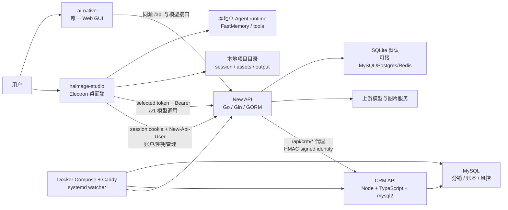
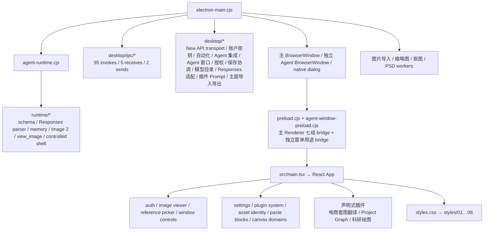

# naimage 工作区上下文地图

> 最近同步：2026-08-15
> 工作区：`E:\019创业项目\nimage`  
> 目的：让开发者和 Agent 快速判断两个项目分别负责什么、修改从哪里进入、需要同步哪些契约和测试。

> Workspace Agent Harness：根目录 `AGENTS.md` 与 `HARNESS.md` 负责意图优先级、任务路由、证据和协作协议；详细规则位于 `harness/`。它不替代本地图或两个子仓库的 `AGENTS.md`。改动 Harness 后运行 `node scripts/verify-harness.mjs`。

## 1. 两个项目分别是什么

| 项目 | 产品角色 | 主要运行位置 | 技术栈 | 权威数据 |
| --- | --- | --- | --- | --- |
| `naimage-studio/` | Windows 桌面创作客户端；无限画布、单 Agent、本地项目/素材/会话、图片导入导出与自动更新 | 用户 Windows 电脑 | Electron 42、React 18、TypeScript、Vite 8、Node/CommonJS、Sharp/PNGJS/OpenCV.js、少量 .NET 工具 | 本地项目 session、项目素材、画布关系、本地 FastMemory、桌面更新状态 |
| `ai-native/` | naimage 的统一后端与运营 monorepo；账号、session、角色、quota、模型路由/计费、唯一 Web GUI、生产部署；现有 CRM 为待删除的旧模块，本轮不修改 | 本地多进程或 Linux/Docker 生产环境 | Node 24、pnpm workspace、Go 1.25/Gin/GORM、React 19/TypeScript/Rsbuild/TanStack/Tailwind 4、Bun workspace、原生 Node HTTP + mysql2、MySQL/SQLite/Postgres/Redis、Docker Compose/Caddy/systemd | 账号身份、角色、quota、模型目录、计费与用量日志、发布清单；CRM 数据仅在旧模块内 |

一句话判断：

- 改桌面画布、项目文件、Agent 本地工具、导入导出或安装更新客户端：进入 `naimage-studio/`。
- 改登录、模型服务、余额/计费、CRM、Web 管理界面、后端 API 或生产部署：进入 `ai-native/`。
- 改远端 API、模型 DTO、更新 manifest 或认证规则：通常需要两边同步。

## 2. 跨项目总体拓扑



## 3. `naimage-studio` 上下文

### 3.1 进程边界



Renderer 没有 Node integration。文件系统、窗口原语、远端会话和更新操作必须通过 `preload.cjs` 的受限 bridge。

### 3.2 当前模块化结果

| 原热点 | 当前状态 | 新边界 |
| --- | --- | --- |
| `src/main.tsx` | 仍是跨域编排热点，但认证、图片查看、参考图选择、窗口控制、设置持久化和多个画布纯域已移出 | `auth-gate.tsx`, `image-viewer.tsx`, `reference-picker-dialog.tsx`, `window-controls.tsx`, `settings-persistence.ts` 与画布域模块 |
| `electron-main.cjs` | 仍是主进程 facade；模型/Responses/项目持久化/New API transport/client、账户密钥、自动化、Agent 集成、独立 Agent 窗口、设备授权、插件 Prompt、主题文件和 95 个 invoke（92 preload + 3 internal）/5 receive/2 send channel 已有独立 owner | `desktop/ipc/*`, `desktop/model-catalog.cjs`, `desktop/agent-responses-adapter.cjs`, `desktop/project-*`, `desktop/project-graph-adapter.cjs`, `desktop/plugin-task-prompts.cjs`, `desktop/theme-preset-service.cjs`, `desktop/new-api-transport.cjs`, `desktop/new-api-client.cjs`, `desktop/account-token-service.cjs`, `desktop/automation-service.cjs`, `desktop/agent-integration-service.cjs`, `desktop/agent-window-service.cjs`, `desktop/license-service.cjs` |
| `agent-runtime.cjs` | 保留 Prompt、tool loop、compact、steer 协议补齐与 action 编排；运行控制器、schema、Responses/Chat parser、memory、图片帧、观察副本和受控 shell 已移出 | `desktop/agent-run-control.cjs`, `runtime/tool-schemas.cjs`, `runtime/responses-parser.cjs`, `runtime/memory-store.cjs`, `runtime/image-frame.cjs`, `runtime/image-batch-normalization.cjs`, `runtime/view-image-payload.cjs`, `runtime/controlled-shell-command.cjs` |
| `src/core.ts` | 仍包含 bridge/type、session v5 journal/checkpoint/barrier 类型和图片算法；节点 mutation 采集由 Main 合并器负责，设置、资产身份、粘贴块已有独立所有者 | `desktop/project-session-merge.cjs`, `settings-persistence.ts`, `asset-identity.ts`, `paste-blocks.ts` |
| `src/styles.css` | 已从约 1 万行变为 28 行有序入口 | `src/styles/01-base-controls.css` 至 `08-motion-accessibility.css` |
| `scripts/aidebug-gui.mjs` | 仍是 GUI 诊断总编排；通用 harness 与多个场景域已移出，Requirement 默认使用轻量六层 fixture，完整 Layer Stack 仅显式运行 | `scripts/aidebug/harness/*`, `scripts/aidebug/suites/*`, `scripts/aidebug-requirement-node-suite.mjs` |

详细符号、调用链和测试映射以 `naimage-studio/docs/CONTEXT_MAP.md` 为准。

### 3.3 常见修改入口

| 需求 | 首要文件 | 必须联动 |
| --- | --- | --- |
| 修改顶栏/窗口按钮 | `src/window-controls.tsx`、相关样式区域 | `ConfigBridge` 类型、`preload.cjs`、窗口 IPC、`test:lifecycle` |
| 修改登录/注册界面 | `src/auth-gate.tsx` | `AppSettings/AuthDraft` 类型、服务登录 bridge、`aidebug:gui` |
| 修改图片查看器 | `src/image-viewer.tsx` | 资产 URL/缩略图规则、浮窗基础设施、`aidebug:gui` |
| 修改参考图选择 | `src/reference-picker-dialog.tsx` | SOURCE/REFERENCE 上限、TaskScope、ask_user 继续执行 |
| 修改设置或旧配置迁移 | `src/settings-persistence.ts` | `AppSettings` 类型、Electron 设置 bridge、`test:settings-persistence` |
| 修改自定义主题或导入导出 | `src/theme-palette-picker.tsx`, `desktop/theme-preset-service.cjs` | `AppSettings.customTheme` 双侧清洗、ConfigBridge/IPC、独立 Agent 主题快照、`test:theme-preset`、快速 `aidebug:gui` |
| 修改资产 ID/路径清洗 | `src/asset-identity.ts` | Electron session 清洗、导入 worker、项目迁移 |
| 修改画布/任务编排 | `src/main.tsx` 与对应 canvas domain | 当前选择、TaskScope、容器/关系、AIDebug 专项 |
| 修改项目节点多窗口持久化 | `src/main.tsx`, `desktop/project-session-merge.cjs`, config IPC | session v5、Main commitRevision、顶层字段 clock、delete/restore tombstone 与 causal barrier、writer checkpoint/30 天 quorum GC、`test:node-mutation-journal`、`test:project-session-merge`、`test:project-session-dual-renderer`、`test:project-io` |
| 修改 Agent 暂停/结束/steer | `desktop/agent-run-control.cjs`, Agent IPC/runtime、主/独立 Renderer | parent/child AbortSignal、节点锁、协议历史补齐、TaskScope update 的 Main 归一化/重哈希/先保存不变量、`test:agent-run-control`、`test:agent-steer`、窗口与 IPC 专项 |
| 修改模型目录缓存 | `desktop/model-catalog.cjs` + `electron-main.cjs` | `model-cache.json`、`cacheOnly` IPC、服务端模型 DTO、设置页和 Agent 模型查询 |
| 修改账号/自定义接入、账户密钥或设备授权 | `desktop/new-api-client.cjs`, `desktop/account-token-service.cjs`, `desktop/license-service.cjs`, `src/auth-gate.tsx` | `account-token-cache.json` 脱敏边界、preload/server IPC、New API `/api/token/*`、`/v1/*`、`/api/naimage/license*` 与凭据隔离测试 |
| 修改外部 Agent 控制或可自动化产品动作 | `desktop/automation-service.cjs`, `desktop/agent-integration-service.cjs`, `src/automation-command-{registry,runtime}.ts`, `integrations/naimage-control/`, Renderer automation commands | loopback 鉴权、endpoint 文件、preload/IPC、Skill 安装路径与 bundle 白名单；`commands.schema.json` 同时驱动 Renderer、CLI 参考和测试。Graph 命令以 `canvas.state` 提供权威 revision/锁/关系并严格校验选择；mutation 强制项目 guard、canvas revision CAS 可选、Requirement update/execute revision 必需；图 mutation 与 create/update 整批提交，execute 仅在异步派发前 fence。GUI 动作变化必须同步 CLI 命令、Skill/参考文档和 `test:automation-service` |
| 修改插件、电商工具栏或 Project Graph | `src/plugin-state.ts`, `src/plugin-system.ts`, `plugins/builtin-manifests.json`, `src/plugins/*`, `desktop/plugin-task-prompts.cjs`, `desktop/project-graph-adapter.cjs` | Electron/Renderer 状态镜像、设置持久化、权限复核、动态 chunk、preload/IPC、`test:plugin-system`、`test:project-graph`；长 Prompt 归 Electron，插件禁止脚本注入、扩展执行和直接写 session |
| 修改 Responses 请求 | `desktop/agent-responses-adapter.cjs` | 流协议、tool schema、`test:agent-protocol` |
| 修改 `view_image` | `runtime/view-image-payload.cjs` + runtime facade | 允许根、payload 预算、Sharp、持久化排除 |
| 修改 Image 2 比例/尺寸 | `runtime/image-frame.cjs`、`src/core.ts`、主进程请求参数 | 三侧规则必须一致 |
| 修改样式 | 对应 `src/styles/NN-*.css` | 不得改变 01→08 顺序；reduced-motion 文件必须最后 |

### 3.4 变更范围内验证

测试开发阶段只运行本次改动直接相关的专项，以及确有跨类型/IPC 合同时需要的 `typecheck` 或 `test:ipc-registration`；可见 UI 改动运行对应的 AIDebug 专项并人工检查截图。不要把账户、插件、主题、Project Graph、完整 AIDebug、`build` 或 `test:bundle` 机械附加到无关改动。正式 `build`、分层 Bundle、产品性能和 `release:final` 只在用户明确要求正式发布/全量验证，或本次改动直接触及对应边界时运行。具体命令按仓库 `AGENTS.md`、`docs/CONTEXT_MAP.md` 的影响矩阵选择。

当前 Renderer Bundle 采用 hard/advisory 分层：initial JS 目标 670,000 B 并允许额外 1,024 B 测量容差，core async 180,000 B、plugin JS 120,000 B、CSS 220,000 B 与首屏依赖/诊断泄漏为硬门禁；core JS 740,000 B 和完整 dist 1,000,000 B 为 advisory。真实启动、内存、缩放、平移、拖动与 long task 由 `aidebug:performance:product` 独立硬门禁负责，Bundle advisory 不能替代产品性能证据。最新构建证据为 initial 670,944 B、core async 88,609 B、plugin 9,258 B、CSS 199,454 B，hard gate 全部通过；core 759,553 B、dist 1,016,274 B 仅告警。

Project Graph 插件批次的 initial 646,764 B、total JS 719,964 B、dist 968,264 B 仅是历史基线；当时“只剩 36 B”的旧总量余量不再作为重构指令。后续 Renderer 功能仍优先复用或进入自然异步模块，但不得仅为跨越任何 Bundle 硬门禁或 advisory 数字牺牲可维护性、引入高风险重构或复杂拆分。

### 3.5 数据安全边界

- 外部拖入图片先复制到当前项目管理目录；不得覆盖用户原图。
- `config/`、Electron `userData/data/`、项目 session、素材、output 和 FastMemory 是用户/运行数据，普通代码整理不得清理。
- Renderer 不展示账户完整 Key、上游 Key、relay token 或 session cookie；账户完整 Key 只存在 Electron Main 内存。磁盘可按账户保存脱敏的密钥列表/选择/原始额度/状态/分组，以及公开的 `quota_per_unit`、`usd_exchange_rate` 快照，但不得包含完整或掩码 Key、Cookie、IP 白名单、模型限制或派生显示文案。
- 自动化服务只监听 `127.0.0.1` 随机端口，每次启动使用随机 Bearer Token；Agent Skill 不读取或输出 endpoint Token，也不直接编辑运行中的项目文件。
- 本轮模块化没有访问线上服务、生产数据或用户项目数据。

## 4. `ai-native` 上下文

### 4.1 Monorepo 组成

| 路径 | 职责 | 关键技术 |
| --- | --- | --- |
| `services/ai-gateway/` | 唯一对外后端入口；检查、构建和启动内嵌 New API | Node/CommonJS 编排 |
| `services/ai-gateway/new-api/` | 账号、session、角色、quota、模型路由/计费、用量、桌面下载/更新/relay | Go 1.25、Gin、GORM、SQLite/MySQL/Postgres、Redis |
| `services/ai-gateway/new-api/web/default/` | 唯一 Web GUI，包括 CRM 页面 | React 19、TypeScript、Rsbuild、TanStack Query/Router/Table、Tailwind 4、VChart |
| `services/crm-api/` | 内部分销、客户归属、佣金、提现、线下充值、账本、风控、审计、月结 | Node HTTP、TypeScript、mysql2 |
| `packages/crm-contracts/` | CRM DTO、常量和前后端共享契约 | TypeScript workspace package |
| `packages/shared/` | 非业务共享工具 | TypeScript workspace package |
| `deploy/production/` | 生产 Compose、Caddy、发布/回滚、备份、验收和 watcher | Docker Compose、Shell、Caddy、systemd |

### 4.2 本地三进程

| 端口 | 服务 | 用途 |
| --- | --- | --- |
| `17860` | New API gateway | API 与嵌入式前端产物入口 |
| `17861` | CRM API | 内部业务服务，仅由 New API 代理正常访问 |
| `17862` | Web dev server | 本地热更新入口，代理到 17860 |

浏览器正常 CRM 链路：

```text
Web GUI → New API session → /api/crm/* → HMAC signed identity → CRM /crm/*
```

CRM 不保存浏览器密码、session、模型 Key 或 New API 余额事实；它只保存分销扩展、账本、风控和运营数据。

### 4.3 常见修改入口

| 需求 | 首要位置 | 必须联动 |
| --- | --- | --- |
| 登录、角色、quota、模型路由/计费 | `new-api` Go controller/service/model | Web DTO、桌面 API 合同、数据库迁移/配置 |
| CRM DTO 或字段 | `packages/crm-contracts` | CRM API 与 Web GUI 同批更新 |
| CRM 分销/账本/风控 | `services/crm-api/src` | MySQL migration、审计、New API quota 协调 |
| CRM 或管理 Web UI | `web/default/src` | Query/Router 契约、New API proxy、响应错误协议 |
| 统一启动/构建 | 根 `scripts/`、`services/ai-gateway/server.cjs` | 三进程端口、构建产物探测、Windows/Linux 差异 |
| 生产部署 | `deploy/production/` | Compose、Caddy、备份、回滚、manifest、systemd watcher |
| 桌面下载/更新 API | New API + `deploy/production/releases` | `naimage-studio` 版本、minimum version、compatibility、公钥、canonical 签名清单与制品；历史签名 sidecar 不进入当前服务路径 |

### 4.4 验证

当前可执行：

```powershell
cd E:\019创业项目\nimage\ai-native
corepack pnpm run verify:workspace
corepack pnpm run crm:check
```

完整 `pnpm run check`/`build` 还需要 New API Web 的 Bun 依赖安装成功。

## 5. 跨仓同步合同

| 合同 | 桌面侧 | 后端侧 | 修改时检查 |
| --- | --- | --- | --- |
| 登录/session/用户 DTO | `desktop/new-api-client.cjs`, `electron-main.cjs`, `src/server.ts`, bridge types | New API user/session controller | cookie、`New-Api-User`、快速本地恢复、后台校验、错误清洗、禁用用户行为 |
| Pro 设备授权 | `desktop/license-service.cjs`, server IPC, `auth-gate.tsx` | New API `naimage_activation_*` model/controller/router | 只约束自定义 Base URL 模式；随机安装 ID、Pro 计划、默认 3 台、永久/限时、hash-only 存储、禁用撤销、24 小时校验缓存与 72 小时离线宽限；账号登录不请求 License |
| 账户密钥 | `desktop/account-token-quota.cjs`, `desktop/account-token-service.cjs`, server IPC, 设置接入页 | New API `/api/status`, `/api/token/*` | 列表/选择/创建/分组/额度/状态/删除；打开设置只读按账户隔离的脱敏快照，显式刷新才联网；原始 quota ÷ `quota_per_unit` = R/USD，再乘 `usd_exchange_rate` 显示人民币，充值 `price` 不得作为汇率；Renderer 只接收脱敏 DTO，完整 Key 仅 Main 内存；兼容原生 New API 直接返回 Key 与扩展 `/key` 端点 |
| 模型目录/分组 | `desktop/model-catalog.cjs`, `desktop/account-token-service.cjs`, 设置/Agent UI | New API models/user groups/token group | 完整列表、默认模型、60 秒运行缓存与离线磁盘快照；设置页 `cacheOnly` 不联网，显式刷新才更新；账号模型调用由所选 token 自身决定 group，模型请求体禁止额外 group |
| Chat/Responses | Responses adapter、agent runtime、`desktop/new-api-client.cjs` | 所选账户 Key 直连 `/v1/chat/completions`、`/v1/responses`；自定义模式直连用户 Base URL | Bearer Key、tool schema、流事件、reasoning、错误协议，禁止 session cookie 与 group 进入模型请求 |
| 图片生成/编辑 | runtime/core/main-process request、`runtime/image-batch-scheduler.cjs`、`desktop/new-api-client.cjs`、`desktop/new-api-transport.cjs`、`src/server.ts`、`src/streaming-image-preview.ts` | New API `POST /v1/image-tasks` / `GET /v1/image-tasks/:id`、现有 `Task`/`SystemTask`、共享 `ExecuteRelay`，以及兼容 `/v1/responses` 与 `/v1/images/*` | 纯文生图创建立即返回、2.5 秒 GET 轮询、queued/running/succeeded/failed、创建成功/结果不明后不重建；ratio/size/quality、参考图、旧同步回退、计费与结果落盘；任务 MVP 无 partial，编辑/参考图仍走原链路，模型请求体不注入 group |
| CRM session | 桌面/Web 的 CRM 入口 | New API proxy + CRM signed identity | 角色、菜单能力、HMAC secret、错误 DTO |
| 桌面更新 | updater、`update-release.cjs`、`runtime/access-variant.cjs`、公钥 | release manifest、下载/更新 API、`deploy/production/verify-installer.sh`、生产制品 | manifest schema 与 `naimage-studio` product 不变；1.0.9 起 canonical 更新安装包固定为 `SparkAI-WorkSpace-Unrestricted-Setup-<version>-x64.exe`，SparkAPI-only 安装包不进入自动更新清单；1.0.8 及以前的已签名清单继续接受历史 `naimage-Setup-*`；Restart ASAR、下载端点和内部兼容身份不变；继续校验 version、minimum version、compatibility、size、SHA-256、Ed25519 signature |

跨仓改动不能只凭单仓测试宣布完成；至少在上下文地图中写明另一侧位置和未验证项。

桌面支持两种互斥出口：账号模式只要成功登录即可进入工作区，不请求设备 License；session cookie + `New-Api-User` 只管理账户、余额和密钥，模型请求以所选账户 Key 向账户地址规范化后的 `/v1/*` 发起，默认组合是 `https://sparkapi.org/v1`。账号模式仍允许每个对话/图片模型单独填写自定义 API Key，优先于模型绑定 Token 和全局 Token，但忽略绑定中的自定义 Base URL 并继续请求账号/Relay 地址。自定义模式必须先以设备 ID 向官方 License 服务激活或校验 `pro` 授权，再只向用户填写的 OpenAI-compatible `/v1/*` 发送本地 API Key；Base URL 与 API Key 不上传 License 服务。两种模型出口都不携带 SparkAPI session、用户 ID 或客户端 `group`；账号分组由 token 自身决定。

纯文生图由所选账户 Key 或自定义图片 Key 优先直连 New API `POST /v1/image-tasks`；服务端完成鉴权、模型限流与渠道选择后把规范化 Images 请求写入现有 `Task`，由现有 `SystemTask` 租约调度在原 HTTP 请求之外调用共享 `ExecuteRelay → ImageHelper`，客户端每 2.5 秒通过 `GET /v1/image-tasks/:id` 查询。上游即使同步运行 3–5 分钟，Cloudflare 只承载短 POST/GET；Task 成功后返回原 Images JSON 并进入既有受管落盘。拿到 `task_id` 或创建结果不明后不得自动重新 POST，短暂查询错误只重试 GET；进程崩溃留下的 running task 标记失败而不重放上游。仅当创建端点明确不支持时，Desktop 才回退既有 `/v1/responses` image_generation → `/v1/images/generations` 同步链路；编辑/参考图继续走 `/v1/images/edits` multipart。任务化 MVP 不提供 partial，旧同步链路的 partial 规则保持不变。账号 Bearer 请求不携带账户 Cookie、用户 ID 或客户端 `group`；浏览器回退通过 Session `/naimage/v1/image-tasks` 别名使用同一后端任务实现。

产品的 canonical 对外身份是 `naimage`；当前桌面账号模型入口为标准 `/v1/*`，包括本轮新增的 `/v1/image-tasks`，账户与密钥管理入口为 `/api/user/*`、`/api/token/*`，下载入口为 `/downloads/naimage-studio/windows`。`/naimage/v1/*` 仍是浏览器 Session Relay/历史扩展合同，本轮只增加 image-task 镜像，不替代 Desktop 的 Bearer `/v1/*`。manifest product、数据格式和 `/naimage-logo.svg` 均使用当前品牌。旧本地项目与设置只保留只读迁移；生产 Compose、容器、网络、数据根和 systemd unit 仍属于既有物理 ABI，本轮没有切换，后续改名必须另开维护窗口并准备备份和回滚。

生图幂等键是计费安全 ABI：Studio 对外发送 `naimage-` 前缀，服务端内部归一化到冻结命名空间并保持上游派生键稳定，确保跨品牌升级重试仍命中同一记录；这不恢复任何旧公共路由。

冻结的 1.0.4 manifest 仅供历史验签；当前后端只接受 `naimage-studio`，因此首次 1.0.5 上线必须与新签名 manifest 原子部署。部署校验默认拒绝历史 product，只有显式只读审计才可开启历史验签开关。

## 6. 本地工具链状态

工作区根提供：

- `scripts/activate-local-toolchain.ps1`
- `scripts/diagnose-local-toolchain.ps1`
- `LOCAL_TOOLCHAIN.md`

已验证版本：Node `24.15.0`、Corepack pnpm `10.12.1`、Bun `1.3.14`/`1.2.23`、Go `1.25.1`、.NET SDK `9.0.316`。

当前本地依赖和工具链已可完成 Studio typecheck/build、New API Web Bun typecheck/build、Go 定向测试与工作区验证。若后续在更深的 Windows 路径重新安装 Bun 依赖，仍需留意系统长路径策略。

## 7. Agent 检索与维护规则

优先检索稳定符号，不依赖行号：

- 桌面：`applyRuntimeActions`, `ConfigBridge`, `createProjectSaveCoordinator`, `responsesRequestFromChatRequest`, `prepareViewImageModelPayload`。
- 后端：`crm_proxy`, `CRM_EMBED_TRUST_SECRET`, `/naimage/v1`, `/api/desktop-update`, `crm_account_events`。

以下变化必须同步本文；若只影响桌面，还必须同步 `naimage-studio/docs/CONTEXT_MAP.md`：

- 新增、删除、移动模块或改变模块所有权。
- 改变公共符号、IPC、API、tool schema、runtime action 或共享 DTO。
- 改变 session、manifest、资产身份、memory、数据库 schema 或更新清单。
- 新增、删除、重命名测试/构建/发布入口。
- 改变两个仓库之间的镜像规则或权威数据归属。
- 准备正式版本且变更跨仓 API、登录、授权、模型、更新或部署契约。版本说明、桌面上下文地图与本工作区地图必须在 `release:final` 之前进入同一冻结提交，避免发布后补文档导致源码指纹变化和整批重跑。

## 8. 当前发布基线

- 当前桌面正式版：`v1.0.7`，冻结源码以同名 annotated tag `v1.0.7` 为准。
- 私有发布页：[naMeaning/naimage v1.0.7](https://github.com/naMeaning/naimage/releases/tag/v1.0.7)。仓库可见性保持 `PRIVATE`。
- Release 资产：Windows x64 Setup、Restart ASAR、签名 `desktop-release.json`、安装包 sidecar 和 `SHA256SUMS.txt`。
- Setup 与 Restart ASAR 的 SHA-256 以同一 Release 中的 `SHA256SUMS.txt` 和签名 manifest 为准。
- 1.0.6 → 1.0.7 Restart 更新、安装/重装/卸载、数据保留/清理、外部项目保护、失败回滚、Ed25519 签名和制品哈希由同一次 `release:final` 正式编排验证。
- 客户端在线更新仍应通过 SparkAPI 受控更新服务分发；不得把私有 GitHub Token 内置进桌面程序。

1.0.7 新增画布剪贴板/拖入、框选与批量连接、可配置图片批次、Agent 暂停/恢复/真实结束/运行中修改、节点锁及多 Renderer 项目/会话并行。项目 session 已升级为 v5 `nodeMutationJournal`：Renderer 记录 upsert/delete/restore 与顶层字段 clock，Main 分配 commitRevision；writer checkpoint、30 天 quorum 过期和 delete/restore causal barrier 支持安全压缩，显式 undo 可恢复已观察 tombstone，并行创建仍按 `persistenceOriginId` 重映射冲突 ID。steer 可在同一父运行中独立 keep/replace/merge/clear SOURCE/REFERENCE；Main 在 child phase 中断前归一化、重哈希、重算节点锁并保存权威快照。共享 automation schema 还同步提供 Graph CLI 原子连接/断开、归组/解散、位移与 Requirement 创建/更新/执行，以及 `canvas.export-image` 的 PNG/JPEG/WebP/AVIF/TIFF 本地导出。上述变化不改变 New API、线上数据或生产部署合同，但上游已接收的被中断请求仍可能计费。
